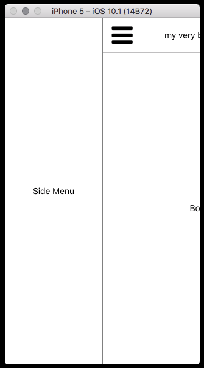

# Simple React Native App Scaffolding

The purpose of this repository is to implement the skeleton of a React Native App.

The App appears as follows:

Clicking on the green header component will open the side menu:

## Libraries used

- react-native-drawer: sidebar
- react-native-vector-icons: icons management
